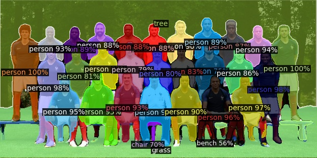

# Experiments on community model zoos

#### Pytorch Detectron

[Postman](postman/Incubating%20Detectron%20API.postman_collection.json)

- `FastAPI` running on Python
- `Pillow`
- [`facebookresearch/detectron2`](https://github.com/facebookresearch/detectron2)

#### Running the server

```bash
pip3 install -r requirements.txt
# Install detectron2 as well, https://github.com/facebookresearch/detectron2/blob/master/INSTALL.md
uvicorn main:app --reload
```


#### Running from Docker

**FIXME**
```bash
docker build -t incubating/detectron-server .
docker run -d -p 80:80 "incubating/detectron-server"
```

#### References

- [Detectron2 / Inference Demo with Pre-trained Models](https://detectron2.readthedocs.io/tutorials/getting_started.html)
- [Detectron2 / Colab](https://colab.research.google.com/drive/16jcaJoc6bCFAQ96jDe2HwtXj7BMD_-m5)
- [FastAPI](https://fastapi.tiangolo.com/)

**To be evaluated**
- [argman/EAST](https://github.com/argman/EAST)
- [clovaai/CRAFT](https://github.com/clovaai/CRAFT-pytorch)
- [eragonruan/text-detection-ctpn](https://github.com/eragonruan/text-detection-ctpn)
